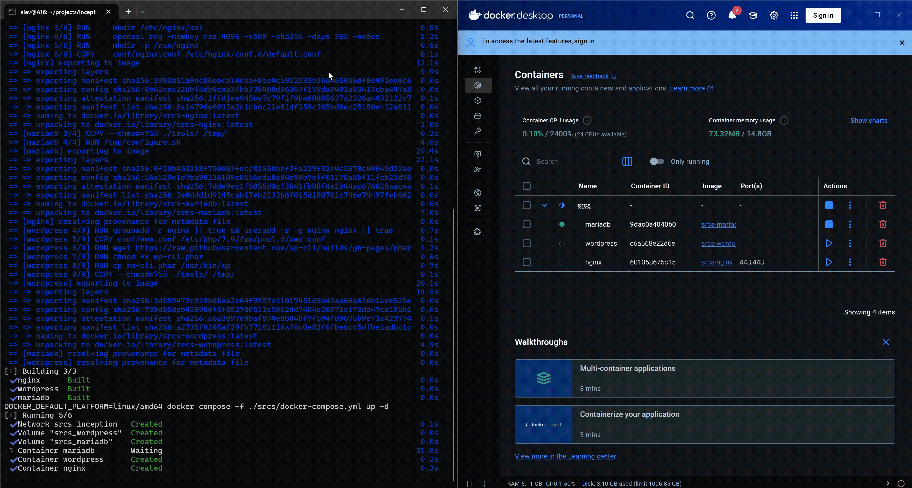

<h1 align="center">
  — Welcome to my GitHub
  
   —
</h1>

Hello, I'm CF 🙋🏻‍♂️
A student from 42 London and a junior software engineer💻

---
### 🛠️ Languages and Tools:

  
  
  
  
  
  
  
  
  
  
  
  

  
  
  
  
  

---
### 🎞️ Selected Projects GIF Showcase:
<h4>
  <a href="https://github.com/pejasco/Fdf/" target="_blank" style="text-decoration: none; color: inherit;">
    FDF 🛕 (Wireframe 3D Viewer)
  </a>
   
  – Click the title above to view the project
</h4>

<h4>
  <a href="https://github.com/pejasco/WebServer" target="_blank" style="text-decoration: none; color: inherit;">
    Webserv 🗄️ (Writing own HTTP server)
  </a>
   
  – Click the title above to view the project
</h4>

<h4>
  <a href="https://github.com/pejasco/Inception" target="_blank" style="text-decoration: none; color: inherit;">
    Inception 📦 (Building custom Docker images from scratch and orchestrating multiple containers)
  </a>
   
  – Click the title above to view the project
</h4>

For more projects, please go to the <a href="https://github.com/pejasco?tab=repositories" target="_blank" rel="noopener noreferrer">Repositories 🗂️</a>

